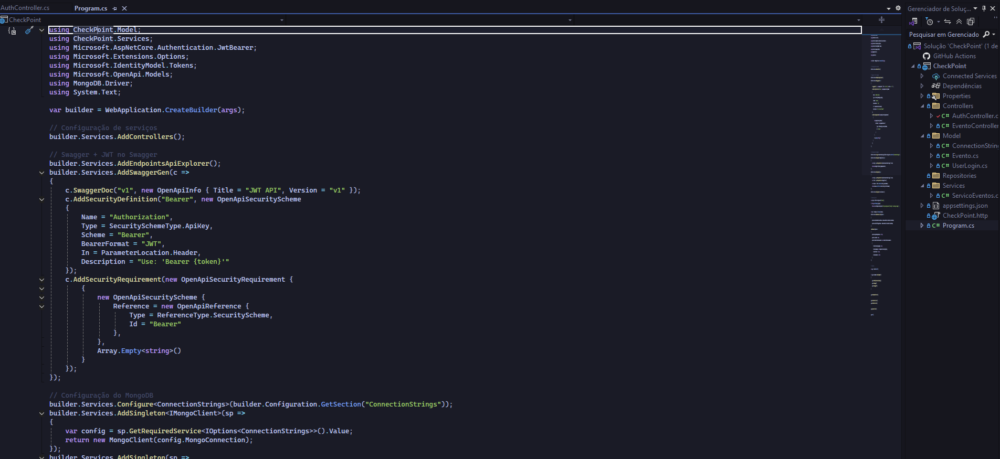
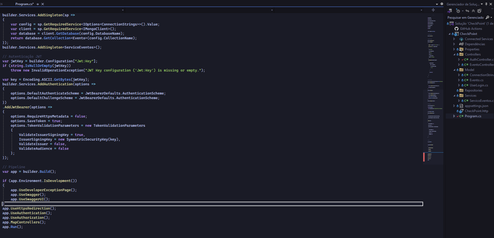
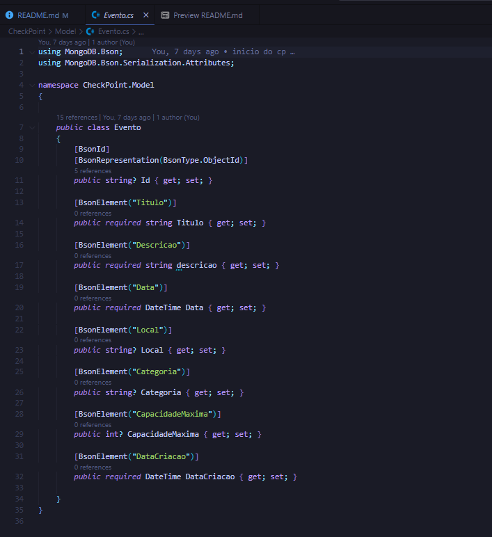
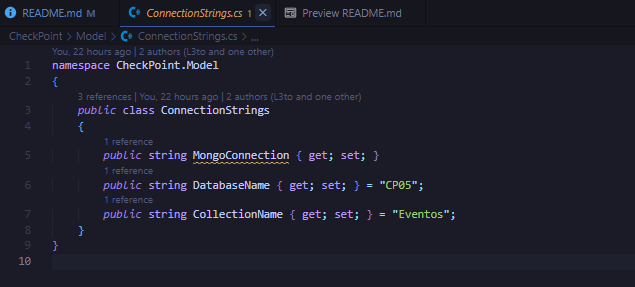
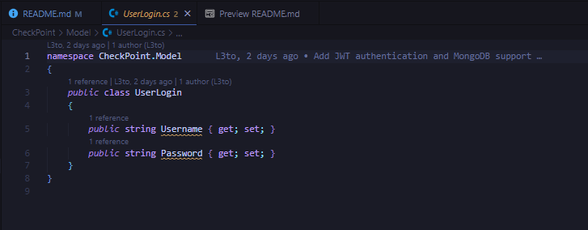
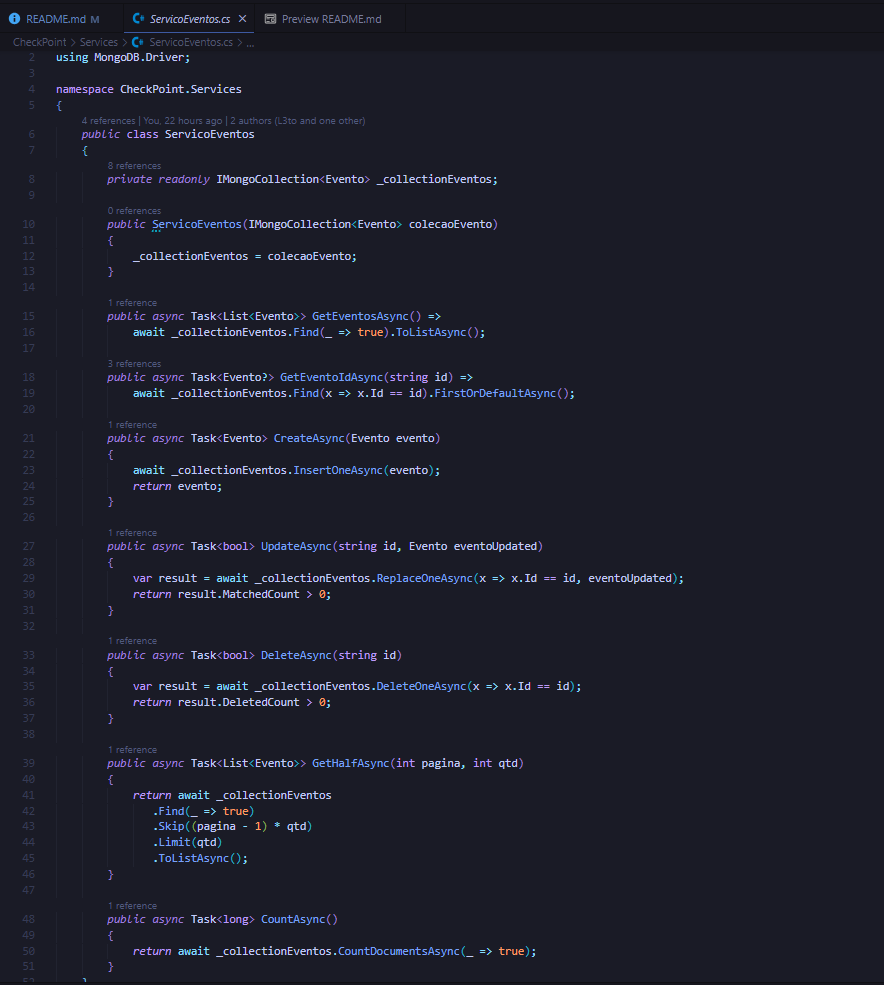
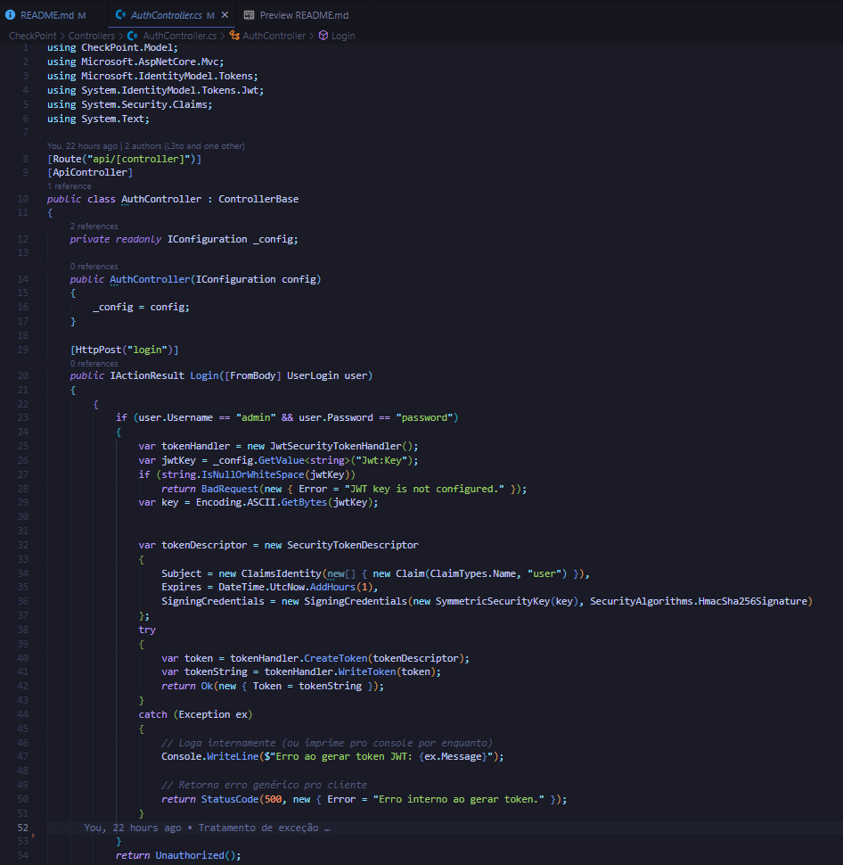
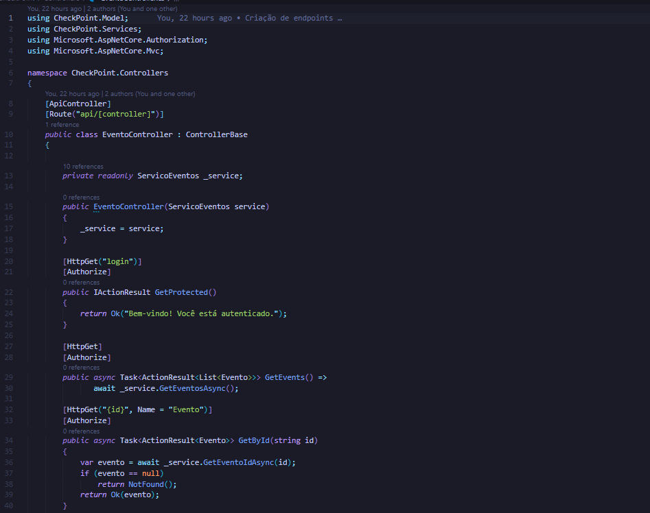
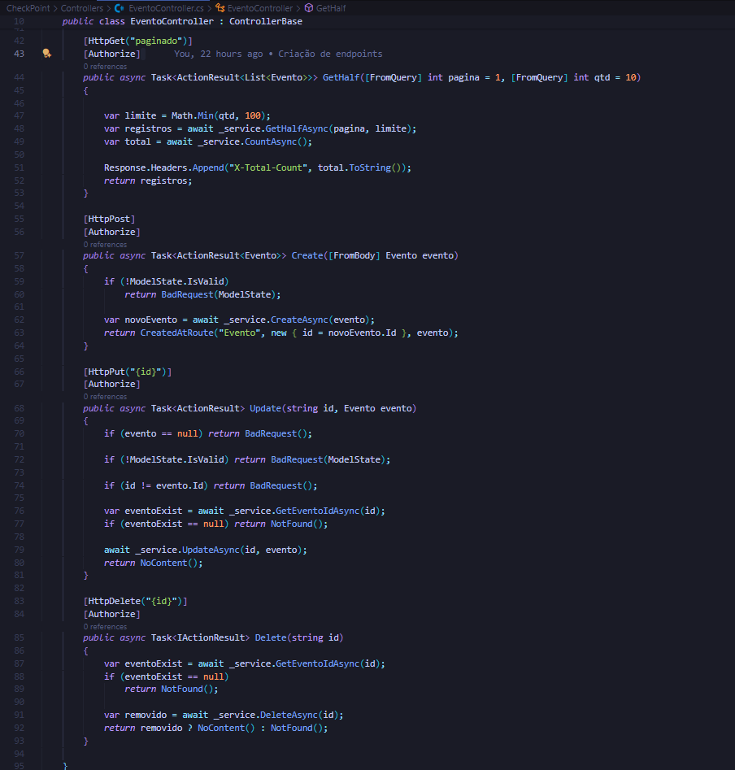

# $ADVANCED-BUSINESS-DEVELOPMENT-WITH-.NET-CP05$

## **Grupo**

| NOME                        | RM     |
| --------------------------- | ------ |
| Francesco M Di Benedetto    | 557313 |
| Samuel Patrick Yariwake     | 556461 |
| Luiz Felipe Campos da Silva | 555591 |

## **Objetivo**

Desenvolver uma API RESTful utilizando ASP.NET Core e MongoDB para
gerenciar eventos culturais. A API permitirá que os usuários possam cadastrar,
editar, listar, e excluir eventos culturais, como shows, exposições de arte,
palestras e festivais. Além disso, a API deverá permitir a autenticação de
usuários via JWT (JSON Web Tokens), garantindo que apenas usuários
autenticados possam interagir com as funcionalidades de gerenciamento. A
API deve implementar as práticas de Clean Code e seguir os princípios
SOLID para garantir um código de alta qualidade, modular e fácil de manter.
Deve-se identificar as partes do código onde foram usados (por comentário)

## **Endpoints**

| Método   | Rota                                   | Descrição                                         |
| -------- | -------------------------------------- | ------------------------------------------------- |
| `POST`   | `/api/Auth/login`                      | Realiza o login do usuário e retorna um token JWT |
| `GET`    | `/api/Evento`                          | Lista todos os eventos                            |
| `GET`    | `/api/Evento/{id}`                     | Busca evento por ID                               |
| `GET`    | `/api/Evento/paginado?pagina=1&qtd=10` | Busca paginada                                    |
| `POST`   | `/api/Evento`                          | Cria novo evento                                  |
| `PUT`    | `/api/Evento/{id}`                     | Atualiza evento                                   |
| `DELETE` | `/api/Evento/{id}`                     | Remove evento                                     |
| `GET`    | `/api/Evento/login`                    | Testa autenticação                                |

## **Prints**

### Program.cs

### Classes

- Evento

---

- ConnectionStrings

---

- UserLogin

---

- ServicoEvento

---

- AuthController

---

- EventoController

## **Link do video**

> [clique aqui](https://www.youtube.com/watch?v=zelmH0AUo0A)

